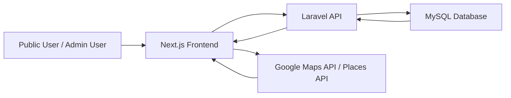
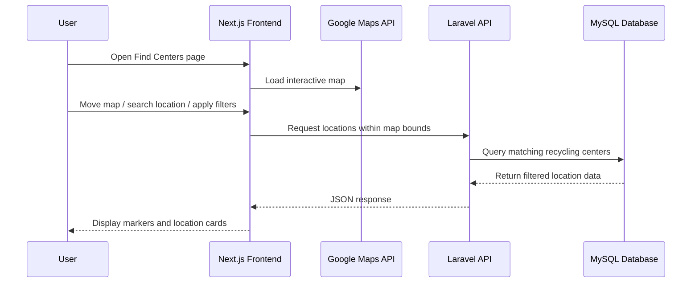
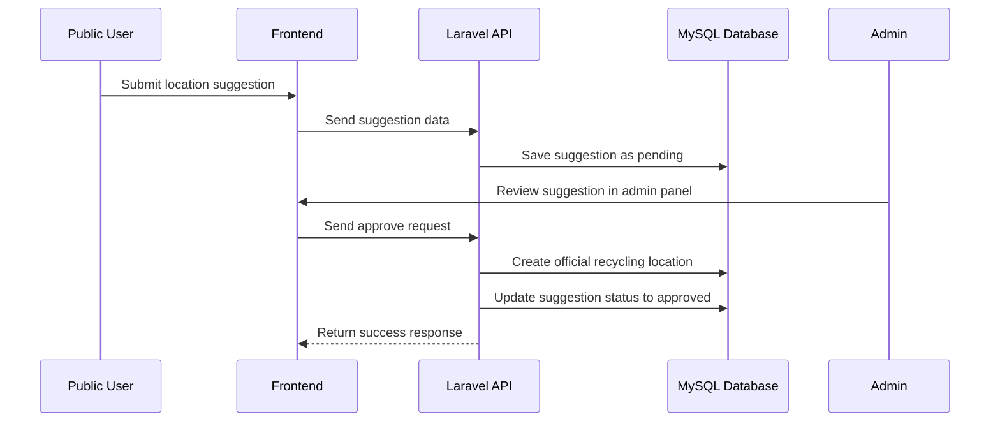
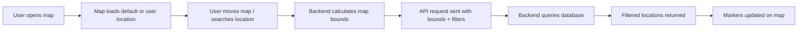
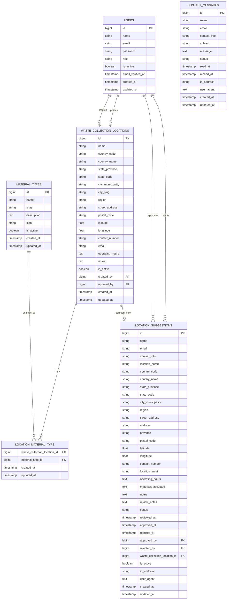
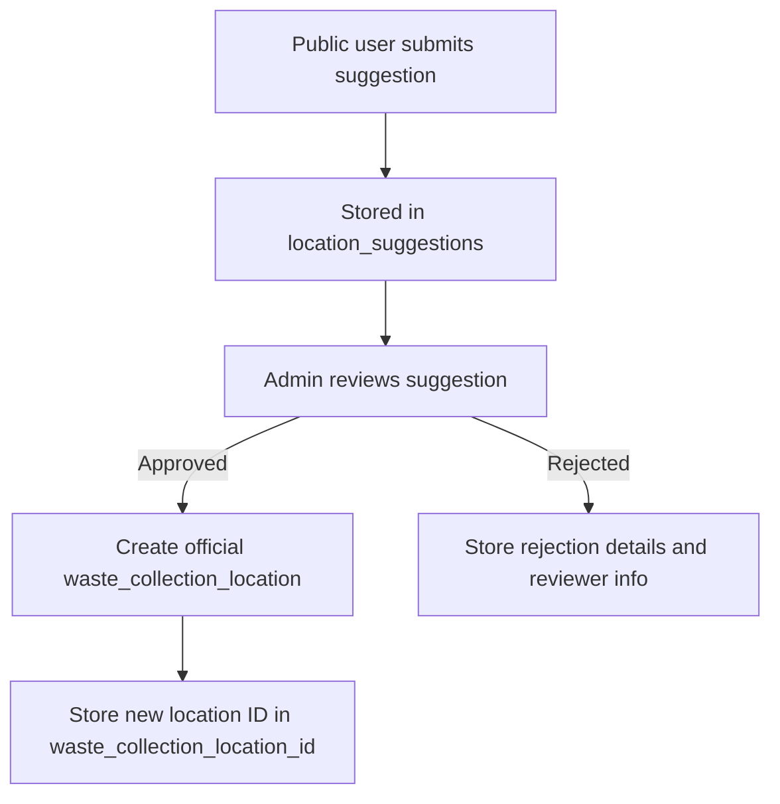
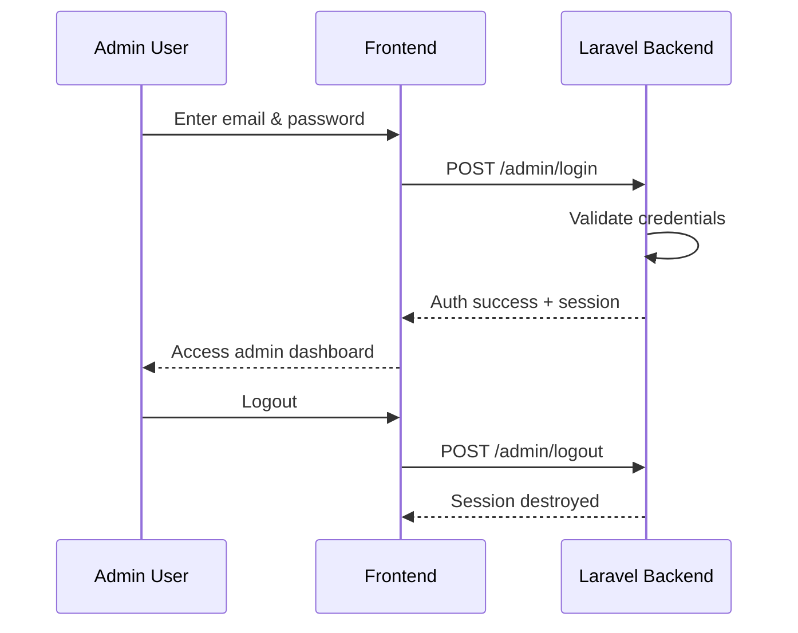
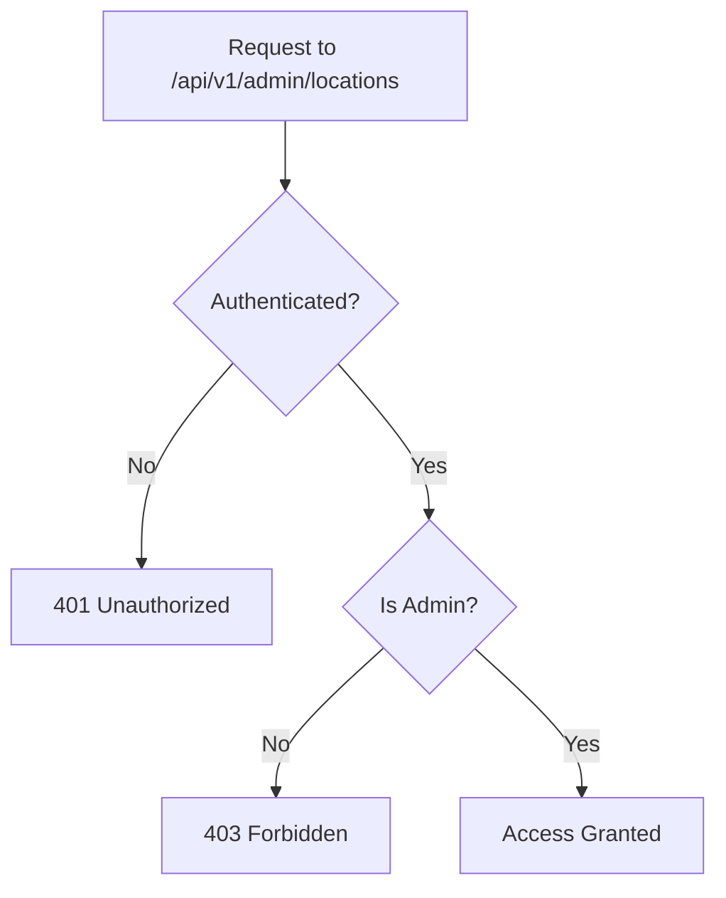
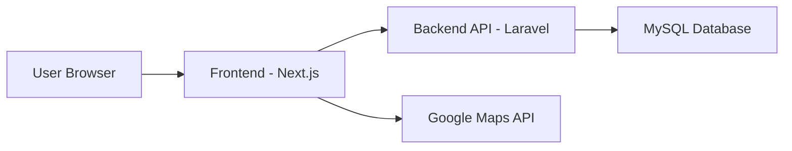

# 0. Project Overview: ♻️ EcoLocator

EcoLocator is a smart waste management platform that helps users locate nearby recycling centers through an interactive map and community-driven data.

## 📌 Project Title

Ecolocator: Waste Collection & Recycling Locator System

## 📄 Project Description

EcoLocator is a web-based application designed to help users easily locate nearby recycling centers and waste collection facilities. It provides essential information such as location, accepted materials, and contact details through an interactive, map-based interface.

The system integrates real-time geolocation, dynamic filtering, and map-based search capabilities to improve accessibility and usability. Additionally, it includes an administrative platform for managing recycling data and moderating user-submitted location suggestions.

## 🛠️ Tech Stack

| Layer     | Technology            |
| --------- | --------------------- |
| Frontend  | Next.js, Tailwind CSS |
| Backend   | Laravel               |
| Database  | MySQL                 |
| Maps      | Google Maps API       |
| State     | React Query           |
| Animation | GSAP                  |

## 🎯 Project Objectives

### General Objective

To promote sustainable waste management by providing an accessible and centralized platform for locating recycling centers.

### Specific Objectives

- Enable users to find nearby recycling centers using an interactive map
- Allow filtering of locations based on accepted material types
- Provide a system for users to suggest new recycling locations
- Implement an admin workflow to review, approve, and manage data
- Improve awareness and participation in environmental sustainability efforts

## 👥 Target Users

1. General Public
   - Individuals looking for recycling centers
   - Environmentally conscious users
   - Households practicing waste segregation
2. Administrators
   - System admins (Super Admin / Editor)
   - Organizations or LGUs managing recycling data

## ✨ Key Features

### 🌍 Public Features
- Interactive map-based search for recycling centers
- Automatic location detection (geolocation)
- Dynamic filtering by material types (e.g., plastic, e-waste, metals)
- Search with Google Places Autocomplete
- Location suggestion submission
- Contact form for inquiries

### 🛠️ Admin Features
- Dashboard with system statistics
- Waste collection location management (CRUD)
- Material type management
- Location suggestion moderation (approve/reject workflow)
- Contact message management with status tracking

## 💡 Significance of the Project

EcoLocator addresses a common problem: lack of accessible information on where to recycle waste. Many individuals are willing to recycle but are unable to do so due to limited knowledge of nearby facilities.

This system contributes to:

- Environmental sustainability by encouraging proper waste disposal
- Community awareness of recycling practices
- Data centralization for recycling centers

## 🧱 Scope and Limitations

### Scope
- Covers recycling centers and waste collection locations
- Provides location-based search within map bounds
- Supports material-based filtering
- Includes admin management system
- Allows user-generated location suggestions

### Limitations
- Requires internet connection
- Dependent on Google Maps API for map functionality
- Accuracy of data depends on admin validation and user submissions
- Limited to areas with available recycling data

## 💻 System Summary

EcoLocator is composed of two main components:

1. Public Web Application
   - Used by general users to search and explore recycling centers

2. Admin Management System
   - Used to manage data, moderate suggestions, and maintain system integrity

These components communicate through a centralized <b>API backend</b>, ensuring scalability and maintainability.

## 📖 Terms and Definitions

- <b>Viewport</b> – the visible area of the map
- <b>Debouncing</b> – delaying API calls until user stops interaction
- <b>Monorepo</b> – a single repository containing multiple applications
- <b>Haversine Formula</b> – used to compute distance between coordinates

<div style="page-break-after: always; visibility: hidden"> \pagebreak </div>

# ⚙️ 1. System Requirements

## 1.1 Overview

This section outlines the necessary software, hardware, and external services required to run the EcoLocator system in both development and production environments.

## 1.2 Software Requirements

#### Backend
- PHP >= 8.1
- Composer
- Laravel Framework

#### Frontend
- Node.js >= 18
- pnpm / npm / yarn

#### Database
- MySQL / MariaDB

#### Development Tools
- Git
- Web browser (Chrome, Edge, Firefox)
- Docker (optional)

## 1.3 External Services

EcoLocator requires integration with:

- Google Maps JavaScript API
- Google Places API

A valid API key is required for map rendering, location search, and geolocation features.

## 1.4 Hardware Requirements

Minimum:
- 8 GB RAM
- Dual-core processor

Recommended:
- 16 GB RAM
- SSD storage

## 1.5 Network Requirements

- Stable internet connection required for:
  - API communication
  - Google Maps services
  - dependency installation

<div style="page-break-after: always; visibility: hidden"> \pagebreak </div>

# 🏗️ 2. System Architecture

EcoLocator works by allowing users to interact with a map interface. The frontend sends requests to the backend API based on user actions such as map movement, filtering, or searching. The backend processes these requests, queries the database, and returns only relevant data, which is then displayed dynamically on the map.

## 2.1 Overview

EcoLocator follows a <b>client-server architecture</b> within a <b>monorepo setup</b>, where the frontend and backend are maintained in a single repository but operate as separate applications.

The system is composed of four major parts:

1. Frontend Web Application<br>
Built with Next.js and Tailwind CSS, this serves the public user interface and admin interface.
2. Backend API<br>
Built with Laravel, this handles business logic, authentication, data processing, and communication with the database.
3. Database<br>
Uses MySQL to store system data such as users, recycling centers, material types, contact messages, and location suggestions.
4. External Services<br>
Google Maps services are used for map rendering, place search, geolocation assistance, and interactive location picking.

## 2.2 Architectural Style

The system uses a three-tier architecture:

#### Presentation Layer

This is the frontend application where users and admins interact with the system through web pages, forms, filters, tables, and maps.

#### Application Layer

This is the Laravel API, which processes requests, applies validation and authorization rules, and executes the business logic.

#### Data Layer

This is the MySQL database, which stores and retrieves persistent system data.

## 2.3 High-Level Architecture Diagram



## 2.4 Monorepo Structure

EcoLocator is organized using a monorepo structure to keep related applications and shared configuration in one codebase.

```
root/
│
├── apps/
│   ├── api/        # Laravel backend API
│   └── web/        # Next.js frontend
│
├── infra/          # Infrastructure and Docker configuration
│
├── package.json
├── pnpm-workspace.yaml
├── turbo.json
└── README.md
```

This setup improves maintainability by allowing both frontend and backend to evolve together while remaining logically separated.

## 2.5 Frontend Architecture

The frontend is built using <b>Next.js</b>, with <b>Tailwind CSS</b> for styling and modular feature-based organization.

#### Main Responsibilities of the Frontend
- Render public pages and admin pages
- Display the interactive map and location markers
- Handle user interactions such as search, filtering, and form submission
- Communicate with the backend API
- Integrate Google Maps and Places features
- Manage UI state such as selected location, filters, theme, and loading states

#### Frontend Modules

Typical frontend modules include:

- Authentication
- Material types
- Recycling centers
- Contact messages
- Location suggestions
- Admin tables and forms
- Shared UI components

## 2.6 Backend Architecture

The backend is built with <b>Laravel</b> and exposes REST-style API endpoints.

#### Main Responsibilities of the Backend
- Receive and validate API requests
- Process business logic
- Handle user authentication and role-based authorization
- Manage CRUD operations for system records
- Approve or reject location suggestions
- Return structured JSON responses to the frontend
- Generate API documentation using Swagger / OpenAPI

#### Backend Design Approach

The backend separates routes and controllers based on access level:

- <b>Public API endpoints</b> for general users
- <b>Admin API endpoints</b> for authorized users

This separation improves security and makes the API easier to maintain.

## 2.7 Database Architecture

The database uses <b>MySQL</b> as the primary relational database management system.

#### Main Data Stored
- User accounts and roles
- Waste collection and recycling locations
- Material types
- User-submitted location suggestions
- Contact messages
- Suggestion review statuses and metadata

Because the database is relational, it supports structured connections between entities such as:
- a recycling center and its material types
- a suggestion and its review status
- an admin user and approved records

## 2.8 External Services Integration

EcoLocator relies on <b>Google Maps Platform</b> for map-related functionality.

#### Google Maps Features Used
- Interactive map rendering
- Place autocomplete for search
- Map-based coordinate selection
- Marker placement
- Location recentering based on selected place or coordinates

This integration enhances user experience by allowing users to visually explore nearby recycling centers and search more efficiently.

## 2.9 Request and Response Flow

The typical request flow in EcoLocator works as follows:

1. A user opens the web application.
2. The frontend displays the interface and loads required components.
3. When the user performs an action, such as searching for a place or filtering materials, the frontend sends a request to the Laravel API.
4. The API validates the request and processes the required logic.
5. The API retrieves or updates data in the MySQL database.
6. The API sends a JSON response back to the frontend.
7. The frontend updates the interface and displays the results to the user.

## 2.10 Example Flow: Finding Nearby Recycling Centers



## 2.11 Example Flow: Location Suggestion Approval



## 2.12 Security and Access Control Architecture

EcoLocator includes role-based access control to protect administrative functions.

#### Access Levels
- Public Users
  - Can browse locations
  - Can submit contact forms
  - Can suggest new locations
- Admin Users
  - Can manage data inside the admin panel
  - Can review and moderate location suggestions
  - Can update statuses of records

#### Admin Roles
- Super Admin
- Editor

Authorization is enforced in the backend using middleware and protected routes.

## 2.13 Scalability and Maintainability Considerations

The architecture of EcoLocator supports future growth because:

- The frontend and backend are clearly separated
- The API is modular and documented
- The database is relational and structured
- Map-based fetching reduces unnecessary data loading
- Public and admin functionality are logically separated
- The monorepo structure keeps the project organized

This makes the system easier to extend with future features such as:

- mobile application support
- analytics dashboards
- AI-based waste classification
- real-time collection schedules

## 2.14 Summary

EcoLocator uses a modern web system architecture composed of a <b>Next.js frontend</b>, <b>Laravel backend</b>, <b>MySQL database</b>, and <b>Google Maps integration</b>. This architecture enables the platform to provide a responsive user experience, secure admin operations, and scalable data management for recycling and waste collection services.

<div style="page-break-after: always; visibility: hidden"> \pagebreak </div>

# 🧩 3. Features Documentation

This section provides a detailed explanation of the system’s functionalities, grouped into Public Features and Admin Features. Each feature describes its purpose, behavior, and how it contributes to the overall system.

## 3.1 Public Features

These features are accessible to all users without requiring authentication.

### 🌍 3.1.1 Interactive Map-Based Search


#### Description:
Users can view recycling centers displayed on an interactive map interface.

#### Key Functionalities:

- Displays markers representing recycling centers
- Automatically updates visible locations based on the current map viewport
- Supports zooming and panning

#### Purpose:
Allows users to visually explore nearby recycling centers in an intuitive and user-friendly way.

### 📡 3.1.2 Location Detection (Geolocation)

#### Description:
The system detects the user’s current location upon initial load (with user permission).

#### Key Functionalities:

- Automatically centers the map based on user location
- Improves relevance of displayed recycling centers

#### Purpose:
Enhances user experience by showing nearby results without requiring manual input.

### 🧠 3.1.3 Smart Map Behavior

#### Description:
The map dynamically responds to user actions and system events.

#### Key Functionalities:

- Auto-centers based on:
  - User location
  - Search selection
  - Selected recycling center
- Debounced API requests when map is moved
- Prevents duplicate requests using cancellation logic

#### Purpose:
Optimizes performance and ensures smooth interaction with the map.

### 🧭 3.1.4 Dynamic Map Filtering API

#### Description:
Only recycling centers within the current map bounds are fetched and displayed.

#### Key Functionalities:

- Sends bounding coordinates (min/max latitude and longitude) to the API
- Returns only relevant data within the visible map area

#### Purpose:
Improves performance and scalability by reducing unnecessary data loading.

### 🏷️ 3.1.5 Material-Based Filtering

#### Description:
Users can filter recycling centers based on accepted material types.

#### Key Functionalities:

- Multi-select filtering (e.g., plastic, metal, e-waste)
- Includes “Select All” and “Clear All” options
- Dynamically updates map results

#### Purpose:
Helps users find locations that accept specific types of recyclable materials.

### 🧾 3.1.6 Compact Location Cards

#### Description:
Displays summarized information about each recycling center.

#### Key Functionalities:

- Shows name and key material types
- Limits visible materials (e.g., first 3 + “See more”)
- Click interaction highlights selected location on map

#### Purpose:
Provides a quick and readable overview of available recycling centers.

### 🔍 3.1.7 Search and Map Integration

#### Description:
Search functionality is integrated with the map using location autocomplete.

#### Key Functionalities:

- Google Places Autocomplete suggestions
- Selecting a suggestion re-centers the map
- Synchronizes search input with map view

#### Purpose:
Allows users to quickly navigate to specific locations.

### 📬 3.1.8 Contact Form

#### Description:
Users can send inquiries or messages to administrators.

#### Key Functionalities:

- Input fields for user details and message
- Data is stored in the system for admin review
- Status tracking (handled in admin panel)

#### Purpose:
Provides a communication channel between users and system administrators.

### 📝 3.1.9 Location Suggestion System


#### Description:
Users can suggest new recycling centers not yet in the system.

#### Key Functionalities:

- Submit location details and materials accepted
- Supports custom entries (e.g., “Others”)
- Stored as pending suggestions

#### Purpose:
Enables community-driven data expansion.

## 3.2 Admin Features

These features are restricted to authorized users (Super Admin and Editor).

### 🔐 3.2.1 Role-Based Access Control

#### Description:
Access to admin features is restricted based on user roles.

#### Roles:
- Super Admin
- Editor

#### Purpose:
Ensures system security and controlled access to sensitive operations.

### 📊 3.2.2 Admin Dashboard


#### Description:
Provides an overview of system statistics.

#### Displayed Data:

- Total recycling centers
- Material types
- Pending location suggestions
- Contact messages

#### Purpose:
Gives administrators quick insights into system activity.

### 🏢 3.2.3 Waste Collection Location Management


#### Description:
Admins can manage recycling center records.

#### Key Functionalities:

- Create, read, update, and deactivate locations
- Set active/inactive status
- Assign material types

#### Purpose:
Maintains accurate and up-to-date location data.

### 🧾 3.2.4 Material Types Management

#### Description:
Admins manage recyclable material categories.

#### Key Functionalities:

- Add, update, and deactivate material types
- Only active materials are visible to public users

#### Purpose:
Ensures consistent classification of recyclable items.

### 📥 3.2.5 Contact Message Management

#### Description:
Admins can manage user inquiries submitted through the contact form.

#### Key Functionalities:

- View messages
- Update status:
  - new
  - read
  - replied
  - archived
- Pagination and filtering

#### Purpose:
Organizes communication and improves response tracking.

### 🧠 3.2.6 Location Suggestion Moderation

#### Description:
Admins review and validate user-submitted location suggestions.

#### Key Functionalities:

- Edit and enrich submitted data
- Approve or reject suggestions
- Add review notes

#### Purpose:
Ensures data quality before adding new recycling centers.

### 📑 3.2.7 Standardized Table System

#### Description:
Admin interface uses a reusable table system for managing data.

#### Key Functionalities:

- Pagination with metadata
- Sortable columns
- Filterable datasets
- Consistent UI components

#### Purpose:
Provides a uniform and efficient data management interface.

### 📍 3.2.8 Interactive Location Picker

#### Description:
Admins can precisely select and adjust location coordinates.

#### Key Functionalities:

- Search places using autocomplete
- Click on map to set coordinates
- Draggable marker for adjustments
- Controlled selection via “Use selected point”

#### Purpose:
Ensures accurate geographic data for recycling centers.

## 3.3 Feature Summary

EcoLocator combines map-based interaction, data filtering, and admin moderation tools to create a complete system for managing and discovering recycling locations.

The integration of public participation (via suggestions) and admin validation ensures both scalability and data reliability.

<div style="page-break-after: always; visibility: hidden"> \pagebreak </div>

# 🗺️ 4. Map & Geolocation Logic
## 4.1 Overview

The EcoLocator system relies on an interactive map powered by the <b>Google Maps Platform</b> to provide location-based services.

This module enables users to:

- View recycling centers geographically
- Search locations using autocomplete
- Filter results dynamically
- Interact with map elements (markers, bounds, zoom)

The system is designed to be efficient, responsive, and scalable by minimizing unnecessary data requests and prioritizing user experience.

## 4.2 Core Map Components
### 4.2.1 Map Rendering

Description:
The map is rendered in the frontend using a React-based integration of Google Maps.

#### Key Functionalities:

- Displays map tiles and geographic data
- Supports zooming, panning, and resizing
- Adapts to light/dark mode

#### Purpose:
Provides a visual interface for exploring recycling locations.

### 4.2.2 Map Markers

#### Description:
Markers represent recycling centers on the map.

#### Key Functionalities:

- Each marker corresponds to a recycling center
- Clicking a marker highlights the selected location
- Custom marker icons are used for branding and visibility

#### Purpose:
Helps users quickly identify and select locations.

### 4.2.3 Map Bounds (Viewport)

#### Description:
The visible portion of the map is defined by geographic boundaries.

#### Key Functionalities:

- Tracks:
  - north
  - south
  - east
  - west
- Updates dynamically when the user moves the map

#### Purpose:
Used to determine which recycling centers should be fetched and displayed.

## 4.3 Location Detection (Geolocation)
### 4.3.1 Initial User Location

#### Description:
On first load, the system attempts to detect the user’s current location using the browser’s geolocation API.

#### Flow:

1. User opens the application
2. Browser requests permission
3. If allowed:
   - Latitude and longitude are retrieved
   - Map centers on the user’s location

#### Fallback Behavior:

- If denied or unavailable:
  - Default coordinates are used

#### Purpose:
Improves usability by immediately showing nearby recycling centers.

## 4.4 Search Functionality (Autocomplete)
### 4.4.1 Place Search Integration

#### Description:
The system integrates Google Places Autocomplete for location search.

#### Key Functionalities:

Suggests locations as the user types
Includes cities, addresses, and landmarks
Selecting a result updates the map center

#### Flow:

1. User types a location (e.g., “Pasig”)
2. Autocomplete suggestions appear
3. User selects a suggestion
4. Map recenters to selected location

#### Purpose:
Allows users to quickly navigate to a specific area.

## 4.5 Dynamic Data Fetching (Viewport-Based)
### 4.5.1 Bounds-Based API Requests

#### Description:
Instead of loading all recycling centers, the system fetches only those within the visible map area.

#### Request Parameters:

- north
- south
- east
- west

#### Backend Behavior:

Queries database for locations within bounds
Returns filtered results

#### Purpose:

- Reduces server load
- Improves performance
- Supports scalability

### 4.5.2 Debouncing and Request Optimization

#### Description:
API requests are optimized to prevent excessive calls.

#### Key Techniques:

- <b>Debouncing:</b><br>
Delays API calls until user stops moving the map
- <b>Request Cancellation:</b><br>
Cancels previous requests when a new one is triggered

#### Purpose:
Ensures efficient and smooth user experience.

## 4.6 Material-Based Filtering Logic
### 4.6.1 Filtering Mechanism

#### Description:
Users can filter locations based on accepted materials.

#### Flow:

1. User selects material types
2. Selected filters are sent to API
3. API returns matching locations

#### Example Filters:

- Plastic
- Metal
- Electronics
- Batteries

#### Purpose:
Helps users find relevant recycling centers faster.

## 4.7 Map Interaction Flow
### 4.7.1 User Interaction Cycle



## 4.8 Location Selection Logic
4.8.1 Selecting a Recycling Center

### Description:
Users can select a location from either the map or list.

### Behavior:

- Clicking a marker/list item:
  - Highlights location
  - Displays additional details

### Purpose:
Synchronizes map and list views.

## 4.9 Location Picker Logic
### 4.9.1 Interactive Coordinate Selection

#### Description:
A map-based tool to set accurate coordinates.

#### Key Functionalities:

- Search using autocomplete
- Click on map to set coordinates
- Drag marker for precision
- Confirm selection via button

#### Important Behavior:

- Coordinates are <b>not saved automatically</b>
- Must click <b>“Use selected point”</b>

#### Purpose:
Prevents accidental or incorrect data entry.

## 4.10 Performance Considerations

EcoLocator implements several strategies to maintain performance:

- Viewport-based data fetching
- Debounced API calls
- Request cancellation
- Efficient state management in frontend

## 4.11 Limitations
- Requires stable internet connection
- Dependent on Google Maps Platform availability
- Accuracy depends on user device GPS and submitted data
- API usage may incur costs depending on request volume

## 4.12 Summary

The Map & Geolocation module is the <b>core of EcoLocator</b>, enabling real-time, interactive, and efficient discovery of recycling centers.

By combining:

- Geolocation
- Autocomplete search
- Viewport-based data fetching
- Smart interaction logic

the system delivers a responsive and scalable location-based experience.

<div style="page-break-after: always; visibility: hidden"> \pagebreak </div>

# 🗄️ 5. Database Design
## 5.1 Overview

EcoLocator uses a <b>relational database design</b> implemented in <b>MySQL</b> to store and manage structured system data. The database supports both the <b>public-facing platform</b> and <b>the admin management system</b>, including recycling locations, material types, contact messages, user accounts, and user-submitted location suggestions.

The database is designed to ensure:

- data integrity through structured relationships
- consistency of location and moderation records
- scalability for future expansion
- maintainability for admin operations

## 5.2 Entity-Relationship Diagram (ERD)



## 5.3 Core Tables Description
### 5.3.1 Users Table

#### Purpose:
Stores authenticated system users who can access the admin panel. Based on the model, users may have the roles super_admin or editor, and admin access is determined through role-checking methods such as isSuperAdmin(), isEditor(), and hasAdminAccess().

#### Important Fields:

- `id` – primary key
- `name` – full name of the user
- `email` – unique login identifier
- `password` – hashed password
- `role` – access level of the user
- `is_active` – indicates whether the account is active
- `email_verified_at` – email verification timestamp
- `created_at`, `updated_at` – audit timestamps

#### Role Values Observed in Model Logic:

- `super_admin`
- `editor`

### 5.3.2 Material Types Table

#### Purpose:
Stores recyclable material categories used for classifying waste collection locations. The model also includes an icon field, which supports visual representation in the frontend. Only active material types should typically be exposed to the public side of the system.

#### Important Fields:

- `id`
- `name`
- `slug`
- `description`
- `icon`
- `is_active`
- `created_at`, `updated_at`

#### Relationships:

- many-to-many with `waste_collection_locations` through the `location_material_type` pivot table

### 5.3.3 Waste Collection Locations Table

#### Purpose:
Stores official recycling centers and waste collection locations displayed to users on the map and in search results. This table contains normalized address information and operational details.

#### Important Fields:

- `id`
- `name`
- `country_code`
- `country_name`
- `state_province`
- `state_code`
- `city_municipality`
- `city_slug`
- `region`
- `street_address`
- `postal_code`
- `latitude`
- `longitude`
- `contact_number`
- `email`
- `operating_hours`
- `notes`
- `is_active`
- `created_by`
- `updated_by`
- `created_at`, `updated_at`

#### Special Model Behavior:

- `city_slug` is automatically generated from `city_municipality`
- `country_code` is converted to uppercase before save
- `state_code` is converted to uppercase before save

#### Relationships:

- belongs to a creator via `created_by`
- belongs to an updater via `updated_by`
- belongs to many `material_types` through `location_material_type`

### 5.3.4 Location Suggestions Table

#### Purpose:
Stores user-submitted location suggestions before they become official waste collection locations. This is one of the most detailed tables in the system because it supports both raw user submission and admin moderation.

#### Important Fields:

- submitter information:
  - `name`
  - `email`
  - `contact_info`
- suggested location details:
  - `location_name`
  - `country_code`
  - `country_name`
  - `state_province`
  - `state_code`
  - `city_municipality`
  - `region`
  - `street_address`
  - `address`
  - `province`
  - `postal_code`
  - `latitude`
  - `longitude`
  - `contact_number`
  - `location_email`
  - `operating_hours`
  - `materials_accepted`
  - `notes`
- moderation fields:
  - `review_notes`
  - `status`
  - `reviewed_at`
  - `approved_at`
  - `rejected_at`
  - `approved_by`
  - `rejected_by`
- linkage and system metadata:
  - `waste_collection_location_id`
  - `is_active`
  - `ip_address`
  - `user_agent`
  - `created_at`, `updated_at`

#### Relationships:

- belongs to approving user through `approved_by`
- belongs to rejecting user through `rejected_by`
- belongs to `waste_collection_location` through `waste_collection_location_id` once approved and converted into an official record

#### Observation:
Unlike the earlier draft, the current model does not define a many-to-many relationship to `material_types`. Instead, accepted materials are currently stored in the `materials_accepted` field.

### 5.3.5 Contact Messages Table

#### Purpose:
Stores inquiries or messages submitted by users through the contact form. This model includes not only the message content but also moderation and tracking metadata.

#### Important Fields:

- `id`
- `name`
- `email`
- `contact_info`
- `subject`
- `message`
- `status`
- `read_at`
- `replied_at`
- `ip_address`
- `user_agent`
- `created_at`, `updated_at`

#### Purpose of Metadata Fields:

- `read_at` – tracks when a message was opened/read
- `replied_at` – tracks when a reply was sent
- `ip_address` – captures request source
- `user_agent` – captures client device/browser context

## 5.4 Pivot Table
### 5.4.1 Location Material Type Table

#### Purpose:
Supports the many-to-many relationship between official waste collection locations and material types. The table name used in the models is `location_material_type`.

#### Fields:

- `waste_collection_location_id` or location foreign key
- `material_type_id`
- `timestamps`

#### Use Case:
A single waste collection location may accept multiple material types, while a single material type may be accepted by multiple locations.

## 5.5 Relationships Summary

The updated model relationships based on your code are:

- <b>User → WasteCollectionLocation</b>
  - one user may create many locations
  - one user may update many locations
- <b>User → LocationSuggestion</b>
  - one user may approve many suggestions
  - one user may reject many suggestions
- <b>WasteCollectionLocation ↔ MaterialType</b>
  - many-to-many through `location_material_type`
- <b>LocationSuggestion → WasteCollectionLocation</b>
  - a suggestion may link to the official location created after approval through `waste_collection_location_id`

## 5.6 Data Integrity and Constraints

The models suggest several integrity and control rules in the system:

- primary keys uniquely identify records
- foreign keys connect moderation and ownership relationships
- boolean flags such as `is_active` are used for activation status
- timestamps support auditability and workflow tracking
- role checks in the `User` model enforce admin permissions
- location suggestions are separated from official locations until approval

## 5.7 Suggestion Approval Data Flow


This reflects the current moderation structure where a suggestion can later reference the official location record that resulted from approval.

## 5.8 Normalization Notes

The schema is mostly normalized because:

- `users`, `material_types`, `waste_collection_locations`, `location_suggestions`, and `contact_messages` are separated by concern
- many-to-many data between locations and materials is stored in a pivot table
- moderation metadata is stored directly in location_suggestions for workflow traceability

One notable design choice is that `materials_accepted` in `location_suggestions` is stored as a direct field instead of through a normalized pivot relation. This is practical for submissions but less normalized than the official location-material design.

## 5.9 Summary

The EcoLocator database is built around five primary entities:

- `users`
- `material_types`
- `waste_collection_locations`
- `location_suggestions`
- `contact_messages`

It also includes the `location_material_type` pivot table to support material classification for official locations. Compared with the earlier draft, the updated schema now more accurately reflects:

- richer address fields for locations
- explicit moderation fields for suggestions
- audit fields for contact messages
- creator/updater tracking for official locations
- icon support for material types

<div style="page-break-after: always; visibility: hidden"> \pagebreak </div>

# 🔌 6. API Documentation
## 6.1 Overview

The Admin API exposes a REST-style backend API for administrative operations. The admin API is responsible for authentication, dashboard statistics, user management, material type management, waste collection location management, contact message moderation, and location suggestion review workflows.

The Public API exposes endpoints that can be accessed by general users without admin authentication. These endpoints support the main user-facing features of EcoLocator, including:
- browsing active waste collection locations
- map-based location discovery
- filtering by material types
- viewing public material types
- submitting contact messages
- submitting location suggestions

## 6.2 Admin API Modules

The admin API is organized into the following functional modules:

- Admin Authentication
- Admin Dashboard
- Admin Users
- Admin Material Types
- Admin Locations
- Admin Contact Messages
- Admin Location Suggestions

## 6.3 Authentication and Access Control

The admin API is intended for authenticated administrative users only. Admin access is restricted to accounts with valid admin roles and active status. Login is handled through the web guard, and protected endpoints require authenticated admin access.

### Admin Roles
- `super_admin`
- `editor`
### Access Rules
- only authenticated admins may access protected admin endpoints
- inactive accounts are denied access to the admin panel
- the routes, admin user management, is expected to be more sensitive, which only `super_admin` can access

## 6.4 Admin Authentication API
### 6.4.1 Login Admin

#### Endpoint
```
POST /api/v1/admin/login
```
#### Description
Authenticates an admin user using email and password. If credentials are valid but the user is not an active admin, access is denied.

#### Request Body
```JSON
{
  "email": "admin@ecolocator.com",
  "password": "password123"
}
```
#### Success Response
```JSON
{
  "message": "Login successful.",
  "user": {
    "id": 1,
    "name": "EcoLocator Super Admin",
    "email": "admin@ecolocator.com",
    "role": "super_admin",
    "is_active": true
  }
}
```
#### Possible Responses

- `200 OK` – login successful
- `401 Unauthorized` – invalid credentials
- `403 Forbidden` – account not allowed to access admin panel
- `422 Unprocessable Entity` – validation failed
### 6.4.2 Get Authenticated Admin Profile

#### Endpoint
```
GET /api/v1/admin/me
```
#### Description
Returns the currently authenticated admin user.

#### Success Response
```JSON
{
  "user": {
    "id": 1,
    "name": "EcoLocator Super Admin",
    "email": "admin@ecolocator.com",
    "role": "super_admin",
    "is_active": true
  }
}
```
#### Possible Responses

- `200 OK`
- `401 Unauthorized`
### 6.4.3 Logout Admin

#### Endpoint
```
POST /api/v1/admin/logout
```
#### Description
Logs out the authenticated admin, invalidates the session, and regenerates the CSRF token.

#### Success Response
```JSON
{
  "message": "Logged out successfully."
}
```
#### Possible Responses

- `200 OK`
- `401 Unauthorized`

## 6.5 Admin Dashboard API
### 6.5.1 Get Dashboard Statistics

#### Endpoint
```
GET /api/v1/admin/dashboard/stats
```
#### Description
Returns summary metrics used by the admin dashboard. The current implementation includes counts for recycling centers, active material types, pending location suggestions, unread contact messages, and contact messages created during the current month.

#### Success Response
```JSON
{
  "data": {
    "recycling_centers_count": 128,
    "material_types_count": 12,
    "pending_location_suggestions_count": 15,
    "unread_contact_messages_count": 6,
    "contact_messages_this_month_count": 42
  }
}
```
#### Possible Responses

- `200 OK`
- `401 Unauthorized`
- `403 Forbidden`

## 6.6 Admin Users API
### 6.6.1 List Admin Users

#### Endpoint
```
GET /api/v1/admin/users
```
#### Description
Returns a paginated list of admin users with optional searching, filtering, and sorting. Users may be filtered by role and active status, and searched by name or email.

#### Query Parameters

- `search`
- `role`
- `is_active`
- `sort` = `name | email | role | is_active | created_at`
- `direction` = `asc | desc`
- `per_page`
### 6.6.2 Create Admin User

#### Endpoint
```
POST /api/v1/admin/users
```
#### Description
Creates a new admin user.

#### Request Body
```JSON
{
  "name": "Editor One",
  "email": "editor1@ecolocator.com",
  "password": "password123",
  "password_confirmation": "password123",
  "role": "editor",
  "is_active": true
}
```
#### Possible Responses

- `201 Created`
- `401 Unauthorized`
- `403 Forbidden`
- `422 Unprocessable Entity`
### 6.6.3 Get One Admin User

#### Endpoint
```
GET /api/v1/admin/users/{user}
```
#### Description
Returns a single admin user record.

#### Possible Responses

- `200 OK`
- `401 Unauthorized`
- `403 Forbidden`
- `404 Not Found`

### 6.6.4 Update Admin User

#### Endpoint
```
PUT /api/v1/admin/users/{user}
```
#### Description
Updates an existing admin user. Password is updated only when explicitly provided.

#### Request Body
```JSON
{
  "name": "Updated Editor",
  "email": "updated.editor@ecolocator.com",
  "password": "newpassword123",
  "password_confirmation": "newpassword123",
  "role": "editor",
  "is_active": true
}
```
#### Possible Responses

- `200 OK`
- `401 Unauthorized`
- `403 Forbidden`
- `404 Not Found`
- `422 Unprocessable Entity`

### 6.6.5 Delete Admin User

#### Endpoint
```
DELETE /api/v1/admin/users/{user}
```
#### Description
Deletes an admin user. The controller prevents a user from deleting their own account. It also deletes the user’s tokens before deletion.

#### Success Response
```JSON
{
  "message": "Admin user deleted successfully."
}
```
#### Special Error Response
```JSON
{
  "message": "You cannot delete your own account."
}
```
#### Possible Responses

- `200 OK`
- `401 Unauthorized`
- `403 Forbidden`
- `404 Not Found`
- `422 Unprocessable Entity`

## 6.7 Admin Material Types API
### 6.7.1 List Material Types

#### Endpoint
```
GET /api/v1/admin/material-types
```
#### Description
Returns a paginated list of material types with support for search, active-status filtering, and sorting.

#### Query Parameters

- `search`
- `is_active`
- `sort` = `name | created_at | updated_at`
- `direction` = `asc | desc`
- `per_page`

#### Response Structure
```JSON
{
  "success": true,
  "message": "Material types fetched successfully.",
  "data": {
    "data": [],
    "links": {
      "first": "...",
      "last": "...",
      "prev": null,
      "next": "..."
    },
    "meta": {
      "current_page": 1,
      "from": 1,
      "last_page": 3,
      "path": "...",
      "per_page": 10,
      "to": 10,
      "total": 25
    }
  }
}
```
### 6.7.2 Get All Active Material Types

#### Endpoint
```
GET /api/v1/admin/material-types/all
```
#### Description
Returns all active material types, but only with id, name, and slug. This is useful for populating dropdowns and selection inputs in forms.

### 6.7.3 Get One Material Type

#### Endpoint
```
GET /api/v1/admin/material-types/{materialType}
```
#### Description
Returns a single material type.

### 6.7.4 Create Material Type

#### Endpoint
```
POST /api/v1/admin/material-types
```
#### Description
Creates a new material type. The slug is automatically generated from the name.

#### Request Body
```JSON
{
  "name": "Plastic",
  "description": "Plastic bottles and containers",
  "icon": "Package",
  "is_active": true
}
```
#### Possible Responses

- `201 Created`
- `401 Unauthorized`
- `422 Unprocessable Entity`
### 6.7.5 Update Material Type

#### Endpoint
```
PUT /api/v1/admin/material-types/{materialType}
```
#### Description
Updates a material type and regenerates its slug from the updated name.

### 6.7.6 Update Material Type Status

#### Endpoint
```
PATCH /api/v1/admin/material-types/{materialType}/status
```
#### Description
Updates the is_active status of a material type. This supports activate/deactivate workflows without deleting records.

#### Request Body
```JSON
{
  "is_active": false
}
```

## 6.8 Admin Locations API
### 6.8.1 List Waste Collection Locations

#### Endpoint
```
GET /api/v1/admin/locations
```
#### Description
Returns a paginated list of waste collection locations for admin management. The endpoint supports searching, location-based filtering, material-based filtering, and sorting. Related material types are eager-loaded.

#### Query Parameters

- `search`
- `country_code`
- `state_province`
- `state_code`
- `city_municipality`
- `city_slug`
- `region`
- `material_type_id`
- `material_slug`
- `sort_by` = `name | city_municipality | state_province | country_name | is_active | created_at | updated_at`
- `sort_order` = `asc | desc`
- `per_page`
### 6.8.2 Create Waste Collection Location

#### Endpoint
```
POST /api/v1/admin/locations
```
#### Description
Creates a new official waste collection location and syncs the related material types. The authenticated user is recorded as both creator and updater.

#### Required Core Fields

- `name`
- `country_code`
- `country_name`
- `state_province`
- `city_municipality`
- `street_address`
- `latitude`
- `longitude`

#### Example Body
```JSON
{
  "name": "Barangay Recycling Center",
  "country_code": "PH",
  "country_name": "Philippines",
  "state_province": "Davao del Sur",
  "state_code": "DVO",
  "city_municipality": "Davao City",
  "region": "Region XI",
  "street_address": "123 Recycling St.",
  "postal_code": "8000",
  "latitude": 7.0707,
  "longitude": 125.6087,
  "contact_number": "09171234567",
  "email": "center@example.com",
  "operating_hours": "Mon-Fri 8AM-5PM",
  "notes": "Walk-in accepted",
  "is_active": true,
  "material_type_ids": [1, 2, 5]
}
```
### 6.8.3 Get One Waste Collection Location

#### Endpoint
```
GET /api/v1/admin/locations/{location}
```
#### Description
Returns one waste collection location with its related material types.

### 6.8.4 Update Waste Collection Location

#### Endpoint
```
PUT /api/v1/admin/locations/{location}
```
#### Description
Updates an existing location. If material_type_ids is present, the material associations are synced. The authenticated user is recorded as the updater.

### 6.8.5 Delete Waste Collection Location

#### Endpoint
```
DELETE /api/v1/admin/locations/{location}
```
#### Description
Deletes a waste collection location.

#### Success Response
```JSON
{
  "message": "Location deleted successfully."
}
```

## 6.9 Admin Contact Messages API
### 6.9.1 List Contact Messages

#### Endpoint
```
GET /api/v1/admin/contact-messages
```
#### Description
Returns paginated contact messages with support for search, status filtering, date filtering, and sorting. Search applies to name, email, and subject.

#### Query Parameters

- `status` = `new | read | replied | archived`
- `search`
- `date_from`
- `date_to`
- `sort_by` = `created_at | updated_at | status | name | email | subject`
- `sort_order` = `asc | desc`
- `per_page`
### 6.9.2 Get Contact Message Details

#### Endpoint
```
GET /api/v1/admin/contact-messages/{id}
```
#### Description
Returns one contact message. If the message has not yet been read, the controller automatically sets `read_at` and changes the status from new to read.

### 6.9.3 Archive Contact Message

#### Endpoint
```
PATCH /api/v1/admin/contact-messages/{id}/archive
```
#### Description
Archives a contact message. If the message has never been opened, `read_at` is also set automatically.

#### Success Response
```JSON
{
  "message": "Contact message archived successfully.",
  "data": {}
}
```
### 6.9.4 Reply to Contact Message

#### Endpoint
```
POST /api/v1/admin/contact-messages/{id}/reply
```
#### Description
Marks a message as replied and stores reply-tracking timestamps. The controller currently contains a TODO for actually sending an email or notification, so the endpoint presently updates system state but does not yet implement outbound messaging.

#### Request Body
```JSON
{
  "reply_message": "Thank you for your inquiry. We will get back to you shortly."
}
```
#### Behavior

- validates `reply_message`
- sets status to `replied`
- sets `read_at` if still null
- sets `replied_at` if still null

## 6.10 Admin Location Suggestions API
### 6.10.1 List Location Suggestions

#### Endpoint
```
GET /api/v1/admin/location-suggestions
```
#### Description
Returns paginated location suggestions with support for filtering by status, province, city or municipality, searching, and sorting. Search applies to location name, address, street address, submitter name, and submitter email.

#### Query Parameters

- `status` = `pending | under_review | approved | rejected | archived`
- `search`
- `province`
- `city_municipality`
- `sort_by` = `created_at | updated_at | status | location_name | city_municipality | province`
- `sort_order` = `asc | desc`
- `per_page`
### 6.10.2 Get One Location Suggestion

#### Endpoint
```
GET /api/v1/admin/location-suggestions/{locationSuggestion}
```
#### Description
Returns one location suggestion.

### 6.10.3 Save Draft Changes to a Suggestion

#### Endpoint
```
PATCH /api/v1/admin/location-suggestions/{locationSuggestion}
```
#### Description
Allows admins to save draft changes to a location suggestion while it is still editable. If the suggestion is in `pending` status, updating it changes the status to `under_review`. If `reviewed_at` is still null, it is set during the first update. Approved and rejected suggestions can no longer be edited.

#### Important Behavior

- pending → becomes `under_review` on first draft update
- `reviewed_at` is set on first review update
- locked statuses: `approved`, `rejected`
### 6.10.4 Approve Location Suggestion

#### Endpoint
```
POST /api/v1/admin/location-suggestions/{locationSuggestion}/approve
```
#### Description
Approves a suggestion and converts it into an official waste collection location. This is one of the most important workflow endpoints in the system.

#### Approval Logic

- only pending or `under_review` suggestions may be approved
- `approved` suggestions cannot be re-approved
- `rejected` suggestions cannot be approved
- required official location fields are validated before approval
- `materials_accepted` is parsed and matched against official material type slugs
- approval fails if some suggested materials do not resolve to official material types
- on success, a waste collection location is created inside a database transaction
- the new location is linked back through `waste_collection_location_id`
- suggestion status is updated to approved
- `approved_by`, `approved_at`, and `reviewed_at` are set

#### Success Response
```JSON
{
  "success": true,
  "message": "Location suggestion approved successfully.",
  "data": {
    "id": 1,
    "status": "approved",
    "waste_collection_location_id": 15
  }
}
```
### 6.10.5 Reject Location Suggestion

#### Endpoint
```
POST /api/v1/admin/location-suggestions/{locationSuggestion}/reject
```
#### Description
Rejects a location suggestion. Approved suggestions cannot be rejected. The system records rejection metadata and optional review notes.

#### Request Body
```JSON
{
  "review_notes": "Insufficient location details"
}
```
#### Behavior

- sets status to `rejected`
- stores `review_notes`
- sets `reviewed_at` if not already set
- sets `rejected_at`
- stores `rejected_by`
### 6.10.6 Delete Location Suggestion

#### Endpoint
```
DELETE /api/v1/admin/location-suggestions/{locationSuggestion}
```
#### Description
Deletes a location suggestion record.

## 6.11 Admin API Validation and Business Rules Summary
- only valid admin users may log in to the admin panel
- inactive users are denied admin access
- users cannot delete their own admin account
- material type slugs are generated from names
- location suggestion editing is disabled once approved or rejected
- suggestion approval requires complete official location data
- suggestion approval also requires all suggested materials to map to official material types
- viewing a contact message can automatically mark it as read
- replying to a contact message updates status and timestamps, even though actual outbound email sending is still - pending implementation

## 6.12 Public API Modules

The Public API is organized into the following modules:

- Public Contact Messages
- Public Location Suggestions
- Public Material Types
- Public Locations

## 6.13 Authentication and Access

The public endpoints shown in the uploaded controllers do not require admin authentication. They are intended for general platform use such as searching locations and submitting forms.

Some submission endpoints explicitly document `rate limiting to 5 requests per minute per IP address`, particularly for contact messages and location suggestions.

## 6.14 Public Contact Messages API
### 6.14.1 Submit Contact Form

#### Endpoint
```
POST /api/v1/contact-messages
```
#### Description
Allows public users to submit inquiries through the contact form. The controller stores the message with default status new and also records the request IP address and user agent for moderation and audit purposes. This endpoint is documented as rate limited to 5 requests per minute per IP address.

#### Request Body
```JSON
{
  "name": "Juan Dela Cruz",
  "email": "juan@example.com",
  "contact_info": "+639171234567",
  "subject": "Inquiry about recycling center",
  "message": "Hello, I would like to ask about the nearest e-waste drop-off center."
}
```
#### Success Response
```JSON
{
  "message": "Contact message submitted successfully.",
  "data": {
    "id": 1,
    "name": "Juan Dela Cruz",
    "email": "juan@example.com",
    "contact_info": "+639171234567",
    "subject": "Inquiry about recycling center",
    "message": "Hello, I would like to ask about the nearest e-waste drop-off center.",
    "status": "new"
  }
}
```
#### Possible Responses

- `201 Created`
- `422 Unprocessable Entity`
- `429 Too Many Requests`

## 6.15 Public Location Suggestions API
### 6.15.1 Submit a New Location Suggestion

#### Endpoint
```
POST /api/v1/location-suggestions
```
#### Description
Allows public users to suggest new waste collection or recycling locations. The controller stores the submission as a `pending` suggestion and records metadata such as IP address and user agent. This endpoint is documented as rate limited to 5 requests per minute per IP address.

#### Required Fields in OpenAPI Annotation

- `name`
- `email`
- `location_name`
- `address`
- `city_municipality`
- `province`

#### Request Body Example
```JSON
{
  "name": "Juan Dela Cruz",
  "email": "juan@example.com",
  "contact_info": "09123456789",
  "location_name": "Barangay Green Recycling Center",
  "address": "123 Mabini Street, Barangay San Isidro",
  "city_municipality": "Pasay City",
  "province": "Metro Manila",
  "postal_code": "1300",
  "latitude": 14.5378,
  "longitude": 121.0014,
  "materials_accepted": "Plastic, paper, e-waste",
  "notes": "Open every Saturday morning."
}
```
#### Additional Supported Fields
The controller also accepts and stores a fuller location structure when present, including:

- `country_code`
- `country_name`
- `state_province`
- `state_code`
- `region`
- `street_address`
- `contact_number`
- `location_email`
- `operating_hours`

#### System Behavior

- creates a new `location_suggestions` record
- sets status to `pending`
- sets `is_active` to `true`
- stores `ip_address`
- stores `user_agent`

#### Success Response
```JSON
{
  "message": "Location suggestion submitted successfully.",
  "data": {
    "id": 1,
    "location_name": "Barangay Green Recycling Center",
    "status": "pending"
  }
}
```
#### Possible Responses

- `201 Created`
- `422 Unprocessable Entity`
- `429 Too Many Requests`

## 6.16 Public Material Types API
### 6.16.1 List All Active Material Types

#### Endpoint
```
GET /api/v1/material-types
```
#### Description
Returns all active material types for public viewing. The result is sorted by name and includes `name`, `slug`, `description`, and `icon`.

#### Success Response
```JSON
{
  "success": true,
  "message": "Material types retrieved successfully.",
  "data": [
    {
      "name": "Plastic",
      "slug": "plastic",
      "description": "Plastic bottles and containers",
      "icon": "Package"
    }
  ]
}
```
#### Possible Responses

- `200 OK`
### 6.16.2 List Active Material Types for Public Filters

#### Endpoint
```
GET /api/v1/material-types/active
```
#### Description
Returns active material types in a lighter response format for public filter controls. The selected fields are `name`, `slug`, and `icon`.

#### Success Response
```JSON
{
  "data": [
    {
      "name": "Plastic",
      "slug": "plastic",
      "icon": "Package"
    }
  ]
}
```
#### Possible Responses

- `200 OK`
### 6.16.3 Get a Single Active Material Type

#### Endpoint
```
GET /api/v1/material-types/{id}
```
#### Description
Returns one active material type by ID. If the material type is inactive or not found, the endpoint returns a 404 response.

#### Success Response
```JSON
{
  "success": true,
  "message": "Material type retrieved successfully.",
  "data": {
    "id": 1,
    "name": "Plastic",
    "slug": "plastic",
    "description": "Plastic bottles and containers",
    "icon": "Package",
    "is_active": true
  }
}
```
#### Not Found Response
```JSON
{
  "success": false,
  "message": "Material type not found."
}
```
#### Possible Responses

- `200 OK`
- `404 Not Found`

## 6.17 Public Locations API
### 6.17.1 List Active Waste Collection Locations

#### Endpoint
```
GET /api/v1/locations
```
#### Description
Returns a paginated list of active waste collection locations for public browsing. The query includes related material types and supports filtering by search terms, location fields, and material-based filters.

#### Supported Filters

- `search`
- `country_code`
- `state_province`
- `state_code`
- `city_municipality`
- `city_slug`
- `region`
- `material_type_id`
- `material_slug`
- `material_slugs[]`

#### Search Behavior
Search applies to:

- `name`
- `street_address`
- `city_municipality`
- `state_province`
- `country_name`

#### Material Filtering Behavior

- `material_type_id` filters by one material type ID
- `material_slug` filters by one material slug
- `material_slugs[]` supports multiple material slugs
- when `material_slugs[]` is provided, it takes precedence over single `material_slug` filtering logic in practice

#### Response Style
This endpoint returns a paginated Laravel resource collection using `WasteCollectionLocationResource`.

### 6.17.2 List Active Waste Collection Locations Within Map Bounds

#### Endpoint
```
GET /api/v1/locations/map
```
#### Description
Returns active waste collection locations constrained to the currently visible map bounds. This endpoint is central to EcoLocator’s map-based UX because it only loads points within the current viewport. It also supports optional user coordinates for distance-based ordering.

#### Required Query Parameters

- `north`
- `south`
- `east`
- `west`

#### Optional Query Parameters

- `material_slug`
- `latitude`
- `longitude`

#### Validation Rules

- latitude bounds must be between `-90` and `90`
- longitude bounds must be between `-180` and `180`
- optional user coordinates follow the same validation rules

#### Core Logic

- only active locations are returned
- only locations with non-null latitude and longitude are included
- the query constrains locations within the bounding box
- material filtering can be applied through `material_slug`
- if user coordinates are provided, the query calculates distance using a Haversine-style formula and orders results by distance
- if user coordinates are not provided, results are ordered by name

#### Example Request
```
GET /api/v1/locations/map?north=14.75&south=14.52&east=121.12&west=120.96&material_slug=plastic&latitude=14.5995&longitude=120.9842
```
#### Response Style
This endpoint returns a collection using `MapWasteCollectionLocationResource`. The selected payload differs depending on whether distance is computed:

- with user coordinates: includes computed `distance`
- without user coordinates: returns basic location coordinates and identifiers

#### Possible Responses

- `200 OK`
- `422 Unprocessable Entity`
### 6.17.3 Get One Active Waste Collection Location

#### Endpoint
```
GET /api/v1/locations/{location}
```
#### Description
Returns a single active waste collection location. If the record exists but is inactive, the endpoint still returns `404 Not Found` to hide inactive entries from public access. Related material types are loaded before returning the resource.

#### Not Found Response
```JSON
{
  "message": "Location not found."
}
```

#### Possible Responses

- `200 OK`
- `404 Not Found`

## 6.18 Public API Business Rules Summary

- public contact form submissions are stored with default status `new`
- public location suggestions are stored with default status `pending`
- both public submission endpoints record request IP address and user agent
- both submission endpoints are documented as rate limited to 5 requests per minute per IP address
- only active material types are visible publicly
- only active waste collection locations are visible publicly
- inactive public material types and inactive locations return or behave as not publicly available
- the map endpoint only returns locations within the requested map bounds
- the map endpoint can optionally sort results by proximity when user coordinates are provided

## 6.19 Full API Summary

The EcoLocator API documentation covers both major access layers:

### Admin API
- authentication
- dashboard statistics
- admin users
- material types
- locations
- contact messages
- location suggestions

### Public API
- contact form submission
- location suggestion submission
- material type listing
- public location browsing
- map-bounds location discovery

## 6.20 Swagger / OpenAPI Support
### 6.20.1 Overview

EcoLocator supports <b>Swagger / OpenAPI-based API documentation</b> to make the backend easier to understand, test, and maintain. The system uses <b>OpenAPI attributes</b> directly in the Laravel controllers, allowing API documentation to stay close to the source code and remain synchronized with endpoint behavior.

This means the API documentation is not written separately by hand. Instead, it is generated from annotations such as:

- `#[OA\Get(...)]`
- `#[OA\Post(...)]`
- `#[OA\Put(...)]`
- `#[OA\Patch(...)]`
- `#[OA\Delete(...)]`
- `#[OA\Tag(...)]`

### 6.20.2 Purpose of Swagger / OpenAPI in EcoLocator

Swagger / OpenAPI support provides the following benefits:

- documents available API endpoints in a structured format
- describes request parameters, request bodies, and expected responses
- helps frontend and backend developers integrate more efficiently
- makes testing endpoints easier through an interactive documentation interface
- improves maintainability as the API grows
- supports clearer handoff for future developers

### 6.20.3 Coverage in the Current Project

#### Admin API Coverage

Documented admin modules include:

- Admin Authentication
- Admin Dashboard
- Admin Users
- Admin Material Types
- Admin Locations
- Admin Contact Messages
- Admin Location Suggestions

#### Public API Coverage

Documented public modules include:

- Public Contact Messages
- Public Location Suggestions
- Public Material Types
- Public Locations

### 6.20.4 Documented Elements

From the current controllers, the OpenAPI annotations already describe many essential parts of the API, including:

- endpoint paths
- HTTP methods
- endpoint summaries
- tags for grouping endpoints
- security requirements for protected routes
- path parameters
- query parameters
- request body schemas
- example values
- common response codes such as `200`, `201`, `401`, `403`, `404`, `422`, and `429`

### 6.20.5 Swagger Generation in the Project

Swagger documentation files are not committed to the repository. Developers must generate them using:
```shell
php artisan l5-swagger:generate
```

The generated documentation is then accessible at:
```
/api/documentation
```

Access the documentation at: http://127.0.0.1:8000/api/documentation

### 6.20.6 Role in Development Workflow

Swagger / OpenAPI support can be used during development for:

- checking available endpoints without manually reading all controllers
- validating request formats before frontend integration
- confirming which fields are required or optional
- reviewing filtering, sorting, and pagination parameters
- testing admin and public endpoints during QA and debugging

<div style="page-break-after: always; visibility: hidden"> \pagebreak </div>

# 🔐 7. Authentication & Authorization
## 7.1 Overview

EcoLocator implements <b>authentication and role-based authorization</b> to secure administrative functionalities while keeping public features accessible to all users.

The system distinguishes between:

- <b>Public Users</b> (no authentication required)
- <b>Admin Users</b> (authentication required)

## 7.2 Authentication Mechanism
### 7.2.1 Admin Authentication

EcoLocator uses session-based authentication via Laravel’s web guard for admin users.

#### Login Flow:

1. Admin submits email and password
2. System validates credentials
3. Laravel authenticates user via Auth::attempt()
4. Session is created upon successful login
5. Authenticated user can access protected routes

#### Key Characteristics:

- Uses cookies/session (not token-based by default)
- CSRF protection enabled
- Logout invalidates session and regenerates CSRF token
### 7.2.2 Public Access

Public endpoints <b>do not require authentication</b>, including:

- Viewing recycling locations
- Viewing material types
- Submitting contact messages
- Submitting location suggestions
## 7.3 Authorization (Role-Based Access Control)

Authorization is enforced using <b>role-based logic</b> defined in the User model and middleware.

### 7.3.1 Admin Roles
| Role          | Description                                                              |
| ------------- | ------------------------------------------------------------------------ |
| `super_admin` | Full access to all admin features                                        |
| `editor`      | Can manage most data but may have restricted access to sensitive actions |

### 7.3.2 Role Checking Methods

The system uses helper methods inside the User model:

- `isSuperAdmin()`
- `isEditor()`
- `hasAdminAccess()`

These methods determine whether a user can access admin routes.

## 7.4 Middleware Protection

Admin routes are protected using middleware such as:

- `auth` → ensures user is authenticated
- `EnsureUserIsAdmin` → ensures user has admin privileges

#### Behavior:

- Unauthenticated users → `401 Unauthorized`
- Non-admin users → `403 Forbidden`
## 7.5 Access Control by Feature
### Public Features (No Authentication Required)
- View locations
- Filter materials
- Use map features
- Submit contact form
- Submit location suggestion
### Admin Features (Authentication Required)
| Feature                 | Required Role |
| ----------------------- | ------------- |
| Dashboard               | Admin         |
| Manage Locations        | Admin         |
| Manage Material Types   | Admin         |
| Review Suggestions      | Admin         |
| Manage Contact Messages | Admin         |
| Manage Admin Users      | Super Admin   |

## 7.6 Account Status Control

The system uses an `is_active` field in the `users` table.

Behavior:
- `is_active = true` → user can log in
- `is_active = false` → login is denied

This allows:

- soft deactivation of accounts
- better control without deleting users

## 7.7 Security Features
EcoLocator includes several built-in security mechanisms:

### 7.7.1 Input Validation
All requests are validated using Laravel Form Requests or $request->validate()

### 7.7.2 CSRF Protection
Enabled for session-based authentication

### 7.7.3 Rate Limiting
Public endpoints (contact form, suggestions) are limited (e.g., 5 requests/minute)

### 7.7.4 Password Security
Passwords are hashed using Laravel’s hashing system

### 7.7.5 Audit Fields
- Tracks:
  - created_by
  - updated_by
  - approved_by
  - rejected_by

## 7.8 Authentication Flow Diagram


<div style="page-break-after: always; visibility: hidden"> \pagebreak </div>

## 7.9 Authorization Flow Example
Example: Accessing Admin Locations API


## 7.10 Limitations
- Currently uses session-based auth only (no JWT or OAuth)
- No multi-factor authentication (MFA)
- No fine-grained permission system (only role-based)

## 7.11 Summary

EcoLocator implements a <b>secure and structured authentication and authorization system</b> using Laravel’s built-in session authentication and role-based access control.

This ensures that:

- public users can freely access essential features
- admin functionalities are protected
- system data integrity is maintained

<div style="page-break-after: always; visibility: hidden"> \pagebreak </div>

# 🎨 8. Frontend Architecture
## 8.1 Overview

The EcoLocator frontend is built using <b>Next.js</b>, with <b>Tailwind CSS</b> for styling and a modular architecture for scalability and maintainability.

The frontend is responsible for:

- rendering public and admin interfaces
- managing UI state and interactions
- integrating with the backend API
- handling map-based features and animations

## 8.2 Core Technologies
| Technology             | Purpose                       |
| ---------------------- | ----------------------------- |
| Next.js                | React framework for SSR/SPA   |
| Tailwind CSS           | Styling and responsive design |
| TypeScript             | Type safety                   |
| React Query (TanStack) | Data fetching and caching     |
| GSAP                   | Animations and scroll effects |
| Google Maps API        | Map rendering and geolocation |

## 8.3 Application Structure
The frontend follows a <b>modular feature-based structure</b>, making it easier to scale and maintain.

### Folder Structure
```
src/
├── app/                # Next.js app router pages
├── modules/            # Feature-based modules
│   ├── admin/
│   ├── admin-contact-messages/
│   ├── admin-location-suggestions/
│   ├── admin-material-types/
│   ├── admin-recycling-centers/
│   ├── admin-users/
│   ├── auth/
│   ├── contact/
│   ├── find-centers/
│   ├── home/
│   ├── location-suggestions/
│   ├── material-types/
│   └── recycling-centers/
│
├── components/         # Reusable UI components
│   └── providers/          # Global providers (theme, store, etc.)
├── lib/                # Utilities (API client, helpers)
├── hooks/              # Custom React hooks
└── types/              # Global types
```

## 8.4 Modular Design Approach

Each feature is encapsulated inside a <b>module</b>, which typically contains:

- API logic
- components
- hooks
- types

Example: Recycling Centers Module
```
modules/recycling-centers/
├── api.ts
├── components/
├── hooks/
└── types.ts
```

#### Benefits:

- better separation of concerns
- easier debugging and testing
- reusable across pages

## 8.5 State Management

EcoLocator uses a combination of:

### 8.5.1 Server State (React Query)

#### Used for:

- fetching API data
- caching responses
- handling loading and error states

#### Examples:

- locations list
- material types
- admin tables

### 8.5.2 Local UI State (React Hooks)

#### Used for:

- selected filters
- active location
- modal states
- map center overrides

## 8.6 API Integration Layer

The frontend communicates with the backend through a centralized API client.

#### Responsibilities:
- sending HTTP requests
- handling errors globally
- attaching credentials (for admin routes)
#### Pattern Used:
feature-based API files (api.ts per module)
reusable API client instance

## 8.7 UI Component System

EcoLocator uses a reusable component system for consistency.

#### Common Components
- Button (variants: primary, secondary, outline, etc.)
- Badge (for materials, statuses)
- Input / FormField
- Table (with sorting and pagination)
- Modal
- Toast

#### Benefits:
- consistent UI across admin and public pages
- faster development
- easier theming

## 8.8 Theming (Light/Dark Mode)

The app supports <b>light and dark themes</b> using:

- `next-themes`
- CSS variables (design tokens)

#### Example Tokens:
```CSS
--background
--foreground
--primary
--card
--muted
```
#### Behavior:
- supports system theme
- user preference stored locally
- dynamic switching

## 8.9 Map Integration

The map is one of the most important frontend components.

#### Features:
- interactive map rendering
- marker display
- bounds-based fetching
- autocomplete search
- location selection

#### Behavior:
- map movement triggers API requests
- markers update dynamically
- selected location syncs with list view

## 8.10 Animations

EcoLocator uses <b>GSAP</b> for animations.

#### Use Cases:
- homepage hero animations
- scroll-triggered sections
- horizontal scrolling sections
- staggered animations

#### Benefits:
- smooth transitions
- improved user engagement
- modern UI feel

## 8.11 Responsive Design

The frontend is designed with a <b>mobile-first approach</b> using Tailwind.

#### Key Strategies:
- breakpoint: md for layout changes
- flexible widths (w-full, max-w-*)
- responsive map sizing
- mobile hamburger menu

## 8.12 Admin Interface Design

The admin panel includes:
- dashboard cards
- data tables with:
  - sorting
  - filtering
  - pagination
- reusable forms for CRUD operations

#### Table Features:
- consistent pagination UI
- filter toolbar
- skeleton loaders
- status badges

## 8.13 Performance Optimizations

The frontend includes several optimizations:

- React Query caching
- debounced API requests (map movement)
- request cancellation
- lazy loading components

## 8.14 Error Handling

The frontend handles errors through:

- API error interceptors
- UI feedback (toasts)
- fallback states (empty lists, loaders)

## 8.15 Summary

The EcoLocator frontend is a <b>modern, scalable, and modular application</b> built using Next.js and Tailwind CSS.

It combines:

- efficient API integration
- dynamic map interactions
- reusable UI components
- animation-driven user experience

to deliver a responsive and user-friendly platform.

<div style="page-break-after: always; visibility: hidden"> \pagebreak </div>

# 🚀 9. Deployment
## 9.1 Overview

EcoLocator is designed to be deployed as a full-stack web application, consisting of:

- Frontend Application (Next.js)
- Backend API (Laravel)
- Database (MySQL)
- External Services (Google Maps API)

Deployment involves configuring each component and ensuring proper communication between them.

## 9.2 Deployment Architecture


## 9.3 Environment Setup
### 9.3.1 Backend Environment Variables (`.env`)
```bash
APP_NAME=EcoLocator
APP_ENV=production
APP_KEY=base64:your_app_key

DB_CONNECTION=mysql
DB_HOST=127.0.0.1
DB_PORT=3306
DB_DATABASE=ecolocator
DB_USERNAME=root
DB_PASSWORD=your_password

SESSION_DRIVER=file
CACHE_DRIVER=file
QUEUE_CONNECTION=sync
```

### 9.3.2 Frontend Environment Variables (`.env.local`)
```bash
NEXT_PUBLIC_API_BASE_URL=https://api.yourdomain.com
NEXT_PUBLIC_GOOGLE_MAPS_API_KEY=your_google_maps_key
```

## 9.4 Backend Deployment (Laravel)
#### Steps:
1. Upload project files to server
2. Install dependencies:
```bash
composer install
```
3. Set environment variables
4. Generate application key:
```bash
php artisan key:generate
```
5. Run database migrations:
```bash
php artisan migrate
```
6. Generate Swagger docs:
```
php artisan l5-swagger:generate
```
7. Optimize application:
```bash
php artisan config:cache
php artisan route:cache
php artisan view:cache
```

## 9.5 Frontend Deployment (Next.js)
#### Steps:

1. Install dependencies:
```bash
pnpm install
```
2. Build the application:
```bash
pnpm run build
```
3. Start production server:
```bash
pnpm run start
```

## 9.6 Database Deployment
- Uses MySQL
- Can be hosted on:
  - local server
  - VPS
  - cloud database services
#### Key Steps:
- create database
- configure `.env`
- run migrations
- optionally seed initial data

## 9.7 Domain and Hosting Setup
#### Example Structure:

- Frontend:
```
https://ecolocator.com
```

- Backend API:
```
https://api.ecolocator.com
```
or (optional)
```
https://ecolocator.com/api
```

#### Configuration:
- configure DNS records
- set up virtual hosts
- enable HTTPS (SSL certificate)

## 9.8 CORS Configuration

The backend must allow requests from the frontend domain.

Example (`config/cors.php`):
```php
'allowed_origins' => [
    'https://ecolocator.com',
    'http://localhost:3000'
],
```

## 9.9 Google Maps API Setup

EcoLocator requires a valid API key from <b>Google Maps Platform</b>.

Steps:
1. Create project in Google Cloud Console
2. Enable:
  - Maps JavaScript API
  - Places API
3. Generate API key
4. Restrict key (recommended)

You can also get a demo API key at
https://mapsplatform.google.com/maps-demo-key/

Add your API key to your frontend .env file:
```bash
NEXT_PUBLIC_GOOGLE_MAPS_API_KEY=your_api_key_here
```

## 9.10 Deployment Considerations
#### Performance
- enable caching (Laravel)
- optimize queries
- use pagination
#### Security
- use HTTPS
- secure API keys
- restrict admin routes
#### Scalability
- separate frontend and backend servers
- use CDN for frontend
- consider load balancing for API

## 9.11 Common Issues and Solutions
| Issue           | Solution                         |
| --------------- | -------------------------------- |
| CORS errors     | update backend CORS config       |
| Map not loading | check API key                    |
| Slow API        | enable caching, optimize queries |
| Auth issues     | check session/cookie config      |

## 9.12 Summary

EcoLocator can be deployed as a <b>production-ready full-stack application</b> using standard web hosting or cloud infrastructure.

The deployment process ensures:

- proper configuration of frontend and backend
- secure API communication
- integration with external services

<div style="page-break-after: always; visibility: hidden"> \pagebreak </div>

# 🧪 10. Testing
## 10.1 Overview

Testing in EcoLocator ensures that both the <b>backend API</b> and <b>frontend application</b> function correctly, securely, and reliably.

The system primarily focuses on:

- Backend testing (Laravel Feature Tests)
- Manual frontend testing and QA
- API validation through Swagger/OpenAPI

## 10.2 Testing Strategy

EcoLocator follows a combination of:

| Type of Testing     | Purpose                                   |
| ------------------- | ----------------------------------------- |
| Feature Testing     | Validate API endpoints and workflows      |
| Integration Testing | Ensure frontend-backend interaction works |
| Manual Testing      | Validate UI behavior and user flows       |
| API Testing         | Test endpoints via Swagger/Postman        |

## 10.3 Backend Testing (Laravel)

The backend uses Laravel’s built-in testing framework for feature testing.

### 10.3.1 Feature Tests

Feature tests simulate real HTTP requests to API endpoints.

Example Scenarios Tested:
- admin authentication (login/logout)
- access control (unauthorized vs authorized users)
- CRUD operations (material types, locations, users)
- filtering and pagination
- location suggestion approval workflow
- contact message status updates

### 10.3.2 Example Test Case
```php
public function test_admin_can_create_material_type()
{
    $admin = User::factory()->create([
        'role' => 'super_admin',
    ]);

    $response = $this->actingAs($admin)->postJson('/api/v1/admin/material-types', [
        'name' => 'Plastic',
    ]);

    $response->assertStatus(201);
}
```

### 10.3.3 Authorization Testing

Ensures proper access control:

- guest users → cannot access admin routes
- non-admin users → receive 403 Forbidden
- admin users → allowed access

## 10.4 API Testing

API endpoints are tested using:

- Swagger UI (`/api/documentation`)
- Postman or similar tools

#### What is Tested:
- request validation
- response structure
- query parameters (filters, sorting)
- status codes

## 10.5 Frontend Testing

Currently, frontend testing is primarily manual.

### 10.5.1 Manual Testing Areas
- map interaction (zoom, pan, markers)
- filtering logic (materials, search)
- autocomplete behavior
- form submissions (contact, suggestion)
- admin CRUD operations
- responsive layout (mobile vs desktop)

### 10.5.2 UI/UX Testing
- correct rendering of components
- loading states (skeleton loaders)
- empty states
- error handling (toasts, messages)

## 10.6 Map Feature Testing

Special attention is given to map-based features:

#### Tested Scenarios:
- map loads correctly
- geolocation detection works
- markers update on bounds change
- debounce prevents excessive API calls
- selecting a location highlights marker

## 10.7 Data Validation Testing

All user inputs are validated both:

#### Backend Validation
- Laravel validation rules
- required fields
- format constraints (email, numbers, etc.)

#### Frontend Validation
- form validation
- user feedback messages

## 10.8 Error Handling Testing

The system ensures proper handling of errors:
- invalid requests → `422`
- unauthorized → `401`
- forbidden → `403`
- not found → `404`

Frontend displays:
- error messages
- toast notifications
- fallback UI

## 10.9 Performance Testing

Basic performance checks include:
- response time of API endpoints
- map loading speed
- number of API requests (debounced behavior)
- pagination effectiveness

## 10.10 Limitations
- no automated frontend testing yet (e.g., Jest, Cypress)
- limited load testing
- no automated end-to-end testing
- relies heavily on manual QA

## 10.11 Suggested Improvements

Future testing improvements may include:

- unit testing for frontend components
- end-to-end testing (Cypress or Playwright)
- automated regression testing
- load and stress testing for API
- CI/CD integration for automated tests

## 10.12 Summary

EcoLocator applies a combination of backend feature testing and manual frontend testing to ensure system reliability.

While backend testing is well-structured using Laravel, frontend testing can be further improved with automated tools in future development.

<div style="page-break-after: always; visibility: hidden"> \pagebreak </div>

# 🧾 11. Conclusion

## 11.1 Summary of the Project

EcoLocator is a <b>web-based waste collection and recycling locator system</b> designed to help users easily find nearby recycling centers and promote proper waste management.

The system integrates:

- interactive map-based search
- material-based filtering
- user-driven location suggestions
- admin moderation workflows

## 11.2 Key Achievements

The project successfully delivers:

- a functional full-stack application
- a scalable API-driven architecture
- a user-friendly interface with real-time map interaction
- a structured admin system for managing data
- comprehensive API documentation using Swagger/OpenAPI

## 11.3 Impact

EcoLocator addresses a real-world problem by:

- improving accessibility to recycling facilities
- encouraging environmentally responsible behavior
- supporting community-driven data collection
- assisting organizations in managing recycling information

## 11.4 Technical Strengths
- modular frontend architecture (Next.js)
- robust backend system (Laravel API)
- efficient database design
- dynamic map-based data handling
- integrated API documentation

## 11.5 Final Remarks

EcoLocator demonstrates how modern web technologies can be used to solve environmental challenges through accessible and scalable digital solutions. This system bridges the gap between environmental awareness and actual action by making recycling locations easily accessible.

With further improvements and wider adoption, the system has the potential to contribute significantly to <b>sustainable waste management and environmental awareness.</b>

<div style="page-break-after: always; visibility: hidden"> \pagebreak </div>

# 🔮 12. Future Enhancements

Potential improvements for EcoLocator include:

- Mobile application (React Native / Flutter)
- AI-based waste classification using image recognition
- Real-time collection schedules integration
- SMS/email notifications for nearby recycling events
- Advanced analytics dashboard for LGUs

<div style="page-break-after: always; visibility: hidden"> \pagebreak </div>

# 👨‍💻 13. Author

This project was designed and developed by <b>Jessa Mae Hernandez</b>

### Contact

For inquiries, suggestions, or collaboration, message: Jessa Mae Hernandez (https://www.linkedin.com/in/jam-hernandez/)