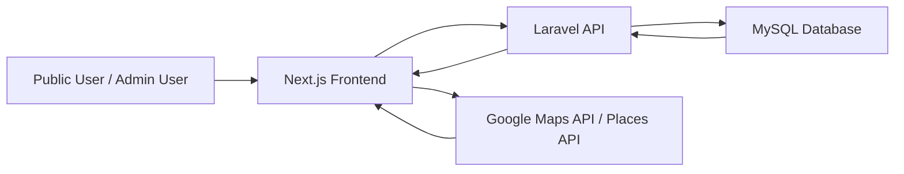
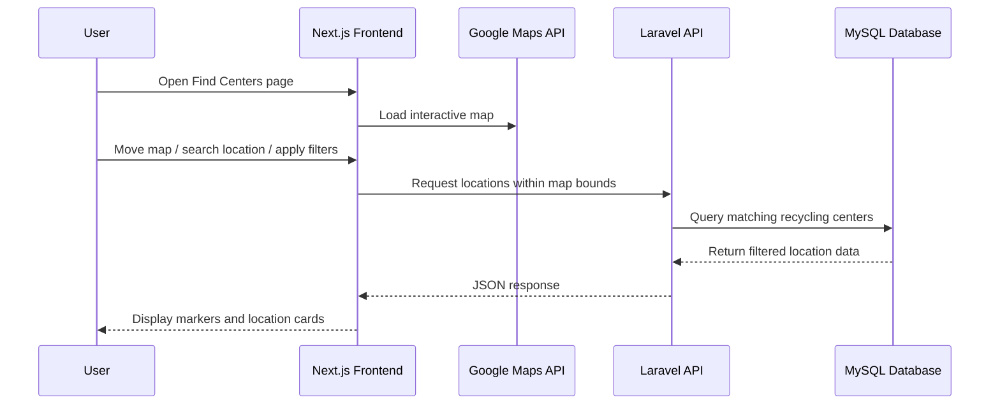
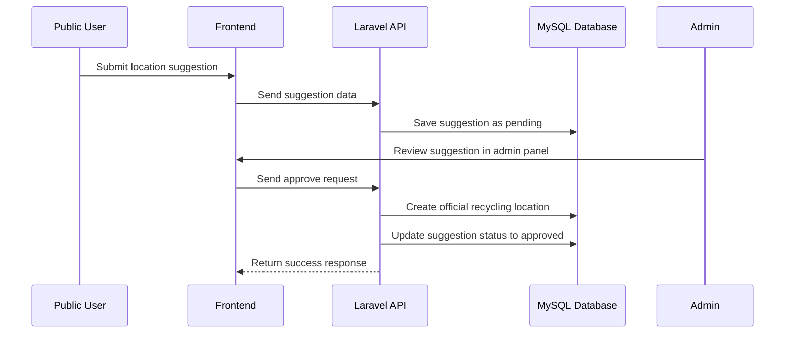

# 1. Project Overview: ♻️ EcoLocator

## 📌 Project Title

Ecolocator: Waste Collection & Recycling Locator System

## 📄 Project Description

EcoLocator is a web-based application designed to help users easily locate nearby recycling centers and waste collection facilities. It provides essential information such as location, accepted materials, and contact details through an interactive, map-based interface.

The system integrates real-time geolocation, dynamic filtering, and map-based search capabilities to improve accessibility and usability. Additionally, it includes an administrative platform for managing recycling data and moderating user-submitted location suggestions.

---

## 🎯 Project Objectives

### General Objective

To promote sustainable waste management by providing an accessible and centralized platform for locating recycling centers.

### Specific Objectives

- Enable users to find nearby recycling centers using an interactive map
- Allow filtering of locations based on accepted material types
- Provide a system for users to suggest new recycling locations
- Implement an admin workflow to review, approve, and manage data
- Improve awareness and participation in environmental sustainability efforts

## 👥 Target Users

1. General Public
   - Individuals looking for recycling centers
   - Environmentally conscious users
   - Households practicing waste segregation
2. Administrators
   - System admins (Super Admin / Editor)
   - Organizations or LGUs managing recycling data

## ✨ Key Features

### 🌍 Public Features
- Interactive map-based search for recycling centers
- Automatic location detection (geolocation)
- Dynamic filtering by material types (e.g., plastic, e-waste, metals)
- Search with Google Places Autocomplete
- Location suggestion submission
- Contact form for inquiries

### 🛠️ Admin Features
- Dashboard with system statistics
- Waste collection location management (CRUD)
- Material type management
- Location suggestion moderation (approve/reject workflow)
- Contact message management with status tracking

## 💡 Significance of the Project

EcoLocator addresses a common problem: lack of accessible information on where to recycle waste. Many individuals are willing to recycle but are unable to do so due to limited knowledge of nearby facilities.

This system contributes to:

- Environmental sustainability by encouraging proper waste disposal
- Community awareness of recycling practices
- Data centralization for recycling centers

## 🧱 Scope and Limitations

### Scope
- Covers recycling centers and waste collection locations
- Provides location-based search within map bounds
- Supports material-based filtering
- Includes admin management system
- Allows user-generated location suggestions

### Limitations
- Requires internet connection
- Dependent on Google Maps API for map functionality
- Accuracy of data depends on admin validation and user submissions
- Limited to areas with available recycling data

## System Summary

EcoLocator is composed of two main components:

1. Public Web Application
  - Used by general users to search and explore recycling centers
  - Admin Management System
  - Used to manage data, moderate suggestions, and maintain system integrity

These components communicate through a centralized <b>API backend</b>, ensuring scalability and maintainability.

# 🏗️ 2. System Architecture
## 2.1 Overview

EcoLocator follows a <b>client-server architecture</b> within a <b>monorepo setup</b>, where the frontend and backend are maintained in a single repository but operate as separate applications.

The system is composed of four major parts:

1. Frontend Web Application<br>
Built with Next.js and Tailwind CSS, this serves the public user interface and admin interface.
2. Backend API<br>
Built with Laravel, this handles business logic, authentication, data processing, and communication with the database.
3. Database<br>
Uses MySQL to store system data such as users, recycling centers, material types, contact messages, and location suggestions.
4. External Services<br>
Google Maps services are used for map rendering, place search, geolocation assistance, and interactive location picking.

## 2.2 Architectural Style

The system uses a three-tier architecture:

### Presentation Layer

This is the frontend application where users and admins interact with the system through web pages, forms, filters, tables, and maps.

### Application Layer

This is the Laravel API, which processes requests, applies validation and authorization rules, and executes the business logic.

### Data Layer

This is the MySQL database, which stores and retrieves persistent system data.

## 2.3 High-Level Architecture Diagram



## 2.4 Monorepo Structure

EcoLocator is organized using a monorepo structure to keep related applications and shared configuration in one codebase.

```
root/
│
├── apps/
│   ├── api/        # Laravel backend API
│   └── web/        # Next.js frontend
│
├── infra/          # Infrastructure and Docker configuration
│
├── package.json
├── pnpm-workspace.yaml
├── turbo.json
└── README.md
```

This setup improves maintainability by allowing both frontend and backend to evolve together while remaining logically separated.

## 2.5 Frontend Architecture

The frontend is built using <b>Next.js</b>, with <b>Tailwind CSS</b> for styling and modular feature-based organization.

### Main Responsibilities of the Frontend
- Render public pages and admin pages
- Display the interactive map and location markers
- Handle user interactions such as search, filtering, and form submission
- Communicate with the backend API
- Integrate Google Maps and Places features
- Manage UI state such as selected location, filters, theme, and loading states

### Frontend Modules

Typical frontend modules include:

- Authentication
- Material types
- Recycling centers
- Contact messages
- Location suggestions
- Admin tables and forms
- Shared UI components

## 2.6 Backend Architecture

The backend is built with <b>Laravel</b> and exposes REST-style API endpoints.

### Main Responsibilities of the Backend
- Receive and validate API requests
- Process business logic
- Handle user authentication and role-based authorization
- Manage CRUD operations for system records
- Approve or reject location suggestions
- Return structured JSON responses to the frontend
- Generate API documentation using Swagger / OpenAPI

### Backend Design Approach

The backend separates routes and controllers based on access level:

- <b>Public API endpoints</b> for general users
- <b>Admin API endpoints</b> for authorized users

This separation improves security and makes the API easier to maintain.

## 2.7 Database Architecture

The database uses <b>MySQL</b> as the primary relational database management system.

### Main Data Stored
- User accounts and roles
- Waste collection and recycling locations
- Material types
- User-submitted location suggestions
- Contact messages
- Suggestion review statuses and metadata

Because the database is relational, it supports structured connections between entities such as:
- a recycling center and its material types
- a suggestion and its review status
- an admin user and approved records

## 2.8 External Services Integration

EcoLocator relies on <b>Google Maps Platform</b> for map-related functionality.

### Google Maps Features Used
- Interactive map rendering
- Place autocomplete for search
- Map-based coordinate selection
- Marker placement
- Location recentering based on selected place or coordinates

This integration enhances user experience by allowing users to visually explore nearby recycling centers and search more efficiently.

### 2.9 Request and Response Flow

The typical request flow in EcoLocator works as follows:

1. A user opens the web application.
2. The frontend displays the interface and loads required components.
3. When the user performs an action, such as searching for a place or filtering materials, the frontend sends a request to the Laravel API.
4. The API validates the request and processes the required logic.
5. The API retrieves or updates data in the MySQL database.
6. The API sends a JSON response back to the frontend.
7. The frontend updates the interface and displays the results to the user.

## 2.10 Example Flow: Finding Nearby Recycling Centers



## 2.11 Example Flow: Location Suggestion Approval



## 2.12 Security and Access Control Architecture

EcoLocator includes role-based access control to protect administrative functions.

### Access Levels
- Public Users
  - Can browse locations
  - Can submit contact forms
  - Can suggest new locations
- Admin Users
  - Can manage data inside the admin panel
  - Can review and moderate location suggestions
  - Can update statuses of records
### Admin Roles
- Super Admin
- Editor

Authorization is enforced in the backend using middleware and protected routes.

## 2.13 Scalability and Maintainability Considerations

The architecture of EcoLocator supports future growth because:

- The frontend and backend are clearly separated
- The API is modular and documented
- The database is relational and structured
- Map-based fetching reduces unnecessary data loading
- Public and admin functionality are logically separated
- The monorepo structure keeps the project organized

This makes the system easier to extend with future features such as:

- mobile application support
- analytics dashboards
- AI-based waste classification
- real-time collection schedules

## 2.14 Summary

EcoLocator uses a modern web system architecture composed of a <b>Next.js frontend</b>, <b>Laravel backend</b>, <b>MySQL database</b>, and <b>Google Maps integration</b>. This architecture enables the platform to provide a responsive user experience, secure admin operations, and scalable data management for recycling and waste collection services.

# 🧩 3. Features Documentation

This section provides a detailed explanation of the system’s functionalities, grouped into Public Features and Admin Features. Each feature describes its purpose, behavior, and how it contributes to the overall system.

## 3.1 Public Features

These features are accessible to all users without requiring authentication.

### 🌍 3.1.1 Interactive Map-Based Search

#### Description:
Users can view recycling centers displayed on an interactive map interface.

#### Key Functionalities:

- Displays markers representing recycling centers
- Automatically updates visible locations based on the current map viewport
- Supports zooming and panning

#### Purpose:
Allows users to visually explore nearby recycling centers in an intuitive and user-friendly way.

### 📡 3.1.2 Location Detection (Geolocation)

#### Description:
The system detects the user’s current location upon initial load (with user permission).

#### Key Functionalities:

- Automatically centers the map based on user location
- Improves relevance of displayed recycling centers

#### Purpose:
Enhances user experience by showing nearby results without requiring manual input.

### 🧠 3.1.3 Smart Map Behavior

#### Description:
The map dynamically responds to user actions and system events.

#### Key Functionalities:

- Auto-centers based on:
  - User location
  - Search selection
  - Selected recycling center
- Debounced API requests when map is moved
- Prevents duplicate requests using cancellation logic

#### Purpose:
Optimizes performance and ensures smooth interaction with the map.

### 🧭 3.1.4 Dynamic Map Filtering API

#### Description:
Only recycling centers within the current map bounds are fetched and displayed.

#### Key Functionalities:

- Sends bounding coordinates (min/max latitude and longitude) to the API
- Returns only relevant data within the visible map area

#### Purpose:
Improves performance and scalability by reducing unnecessary data loading.

### 🏷️ 3.1.5 Material-Based Filtering

#### Description:
Users can filter recycling centers based on accepted material types.

#### Key Functionalities:

- Multi-select filtering (e.g., plastic, metal, e-waste)
- Includes “Select All” and “Clear All” options
- Dynamically updates map results

#### Purpose:
Helps users find locations that accept specific types of recyclable materials.

### 🧾 3.1.6 Compact Location Cards

#### Description:
Displays summarized information about each recycling center.

#### Key Functionalities:

- Shows name and key material types
- Limits visible materials (e.g., first 3 + “See more”)
- Click interaction highlights selected location on map

#### Purpose:
Provides a quick and readable overview of available recycling centers.

### 🔍 3.1.7 Search and Map Integration

#### Description:
Search functionality is integrated with the map using location autocomplete.

#### Key Functionalities:

- Google Places Autocomplete suggestions
- Selecting a suggestion re-centers the map
- Synchronizes search input with map view

#### Purpose:
Allows users to quickly navigate to specific locations.

### 📬 3.1.8 Contact Form

#### Description:
Users can send inquiries or messages to administrators.

#### Key Functionalities:

- Input fields for user details and message
- Data is stored in the system for admin review
- Status tracking (handled in admin panel)

#### Purpose:
Provides a communication channel between users and system administrators.

### 📝 3.1.9 Location Suggestion System

#### Description:
Users can suggest new recycling centers not yet in the system.

#### Key Functionalities:

- Submit location details and materials accepted
- Supports custom entries (e.g., “Others”)
- Stored as pending suggestions

#### Purpose:
Enables community-driven data expansion.

## 3.2 Admin Features

These features are restricted to authorized users (Super Admin and Editor).

### 🔐 3.2.1 Role-Based Access Control

#### Description:
Access to admin features is restricted based on user roles.

#### Roles:

- Super Admin
- Editor

#### Purpose:
Ensures system security and controlled access to sensitive operations.

### 📊 3.2.2 Admin Dashboard

#### Description:
Provides an overview of system statistics.

#### Displayed Data:

- Total recycling centers
- Material types
- Pending location suggestions
- Contact messages

#### Purpose:
Gives administrators quick insights into system activity.

### 🏢 3.2.3 Waste Collection Location Management

#### Description:
Admins can manage recycling center records.

#### Key Functionalities:

- Create, read, update, and deactivate locations
- Set active/inactive status
- Assign material types

#### Purpose:
Maintains accurate and up-to-date location data.

### 🧾 3.2.4 Material Types Management

#### Description:
Admins manage recyclable material categories.

#### Key Functionalities:

- Add, update, and deactivate material types
- Only active materials are visible to public users

#### Purpose:
Ensures consistent classification of recyclable items.

### 📥 3.2.5 Contact Message Management

#### Description:
Admins can manage user inquiries submitted through the contact form.

#### Key Functionalities:

- View messages
- Update status:
  - new
  - read
  - replied
  - archived
- Pagination and filtering

#### Purpose:
Organizes communication and improves response tracking.

### 🧠 3.2.6 Location Suggestion Moderation

#### Description:
Admins review and validate user-submitted location suggestions.

#### Key Functionalities:

- Edit and enrich submitted data
- Approve or reject suggestions
- Add review notes

#### Purpose:
Ensures data quality before adding new recycling centers.

### 📑 3.2.7 Standardized Table System

#### Description:
Admin interface uses a reusable table system for managing data.

#### Key Functionalities:

- Pagination with metadata
- Sortable columns
- Filterable datasets
- Consistent UI components

#### Purpose:
Provides a uniform and efficient data management interface.

### 📍 3.2.8 Interactive Location Picker

#### Description:
Admins can precisely select and adjust location coordinates.

#### Key Functionalities:

- Search places using autocomplete
- Click on map to set coordinates
- Draggable marker for adjustments
- Controlled selection via “Use selected point”

#### Purpose:
Ensures accurate geographic data for recycling centers.

## 3.3 Feature Summary

EcoLocator combines map-based interaction, data filtering, and admin moderation tools to create a complete system for managing and discovering recycling locations.

The integration of public participation (via suggestions) and admin validation ensures both scalability and data reliability.
----------

## ⚙️ Requirements

Make sure you have the following installed:

- Node.js (v18+ recommended)
- pnpm (or npm/yarn)
- PHP (v8.1+)
- Composer
- MySQL (or MySQL Workbench or MariaDB)
- Git
- Docker (optional)
- Required Google Maps API

---

## 🗺️ Google Maps API Key (Required)

EcoLocator uses Google Maps for the interactive map and location-based features.

To run the project locally, you need a Google Maps API Key.

### 🔑 Get a Demo API Key

You can quickly get a demo key here:
https://mapsplatform.google.com/maps-demo-key/

### ⚙️ Setup

Add your API key to your frontend .env file:

`NEXT_PUBLIC_GOOGLE_MAPS_API_KEY=your_api_key_here`
### 📌 Notes
- Required for:
  - Map rendering
  - Location detection
  - Map-based filtering
- Without this key, the map will not load properly

---

## 🚀 Local Setup Guide

### 1. Clone the Repository

```bash
git clone https://github.com/jamloresto/cmsc-207-ecolocator.git
cd cmsc-207-ecolocator
```

---

### 2. Install Frontend & Workspace Dependencies

Using **pnpm (recommended)**:

```bash
pnpm install
```

> This installs all dependencies including `node_modules` for the entire monorepo.

---

### 3. Setup Backend (Laravel API)

Go to the API folder:

```bash
cd apps/api
```

### Install PHP dependencies:

```bash
composer install
```

---

### 4. Setup Environment File

Copy `.env.example`:

```bash
cp .env.example .env
```

Generate app key

```bash
php artisan key:generate
```

---

### 5. Configure Database

Edit `.env`:

```bash
DB_CONNECTION=mysql
DB_HOST=127.0.0.1
DB_PORT=3306
DB_DATABASE=ecolocator
DB_USERNAME=root
DB_PASSWORD=your_password
```

---

### 6. Create Database

Using MySQL:

```sql
CREATE DATABASE ecolocator;
```

---

### 7. Run Migrations

```bash
php artisan migrate
```

(Optional: seed data if available)

```bash
php artisan db:seed
```

---

### 8. Run the Backend Server

```bash
php artisan serve
```

>Backend will run at: http://127.0.0.1:8000

---

### 9. Run the Frontend

Go to web app:

```bash
cd ../web
pnpm dev
```

>Frontend will run at: http://localhost:3000

---

## 🧪 Running Tests

From `apps/api`:

```bash
php artisan test
```

---

## 📄 API Documentation (Swagger)

Generate Swagger docs:

```bash
php artisan l5-swagger:generate
```

Access documentation: http://127.0.0.1:8000/api/documentation


---

## 🐳 (Optional) Docker

If using Docker:

```bash
docker compose -f infra/ecolocator/docker-compose.yml up -d
```

---

## 🔑 Notes

- `node_modules` is **not included** in the repository → run `pnpm install`
- `.env` is **not included** → copy from `.env.example`
- Database must be **manually created** before running migrations
- Public users can:
  - View locations
  - Submit contact forms
  - Suggest new locations
- Admin users (Super Admin / Editor) can:
  - Manage waste collection locations
  - Review, edit, approve, or reject location suggestions
- Location suggestions go through a **review + approval workflow**
  before becoming official locations

---

## 📬 Contact

For inquiries, suggestions, or collaboration, message: Jessa Mae Hernandez (https://www.linkedin.com/in/jam-hernandez/)